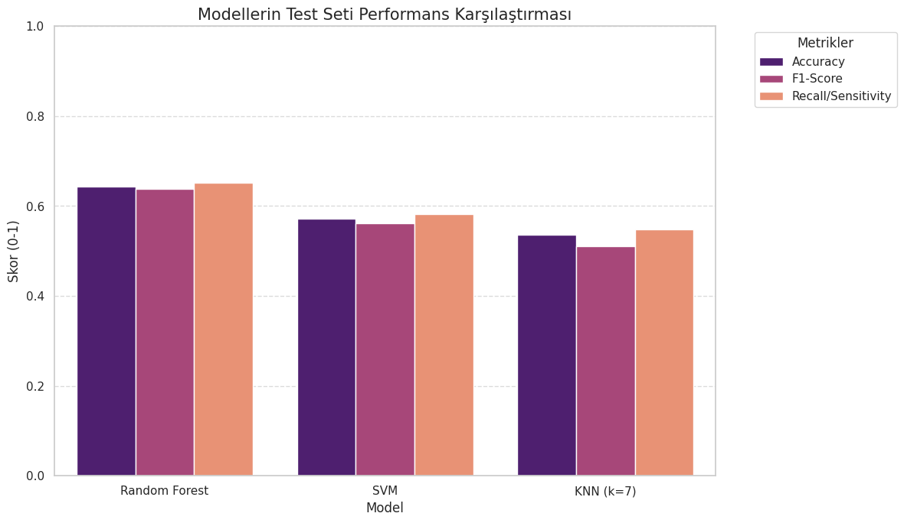
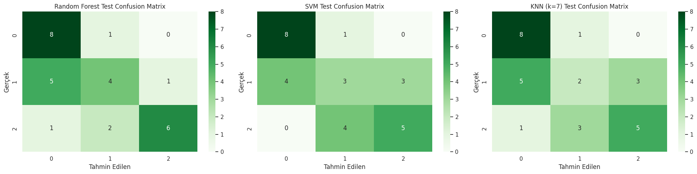
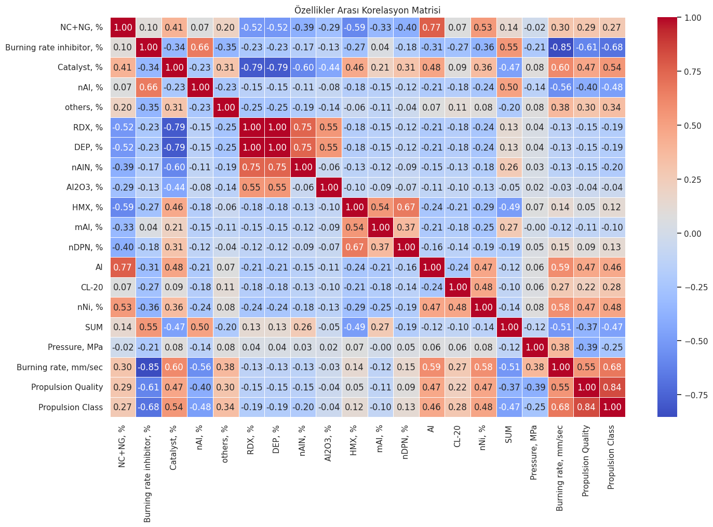
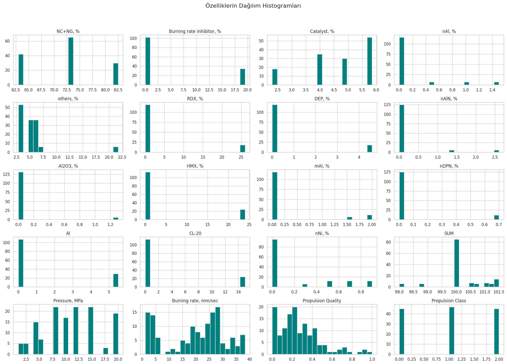
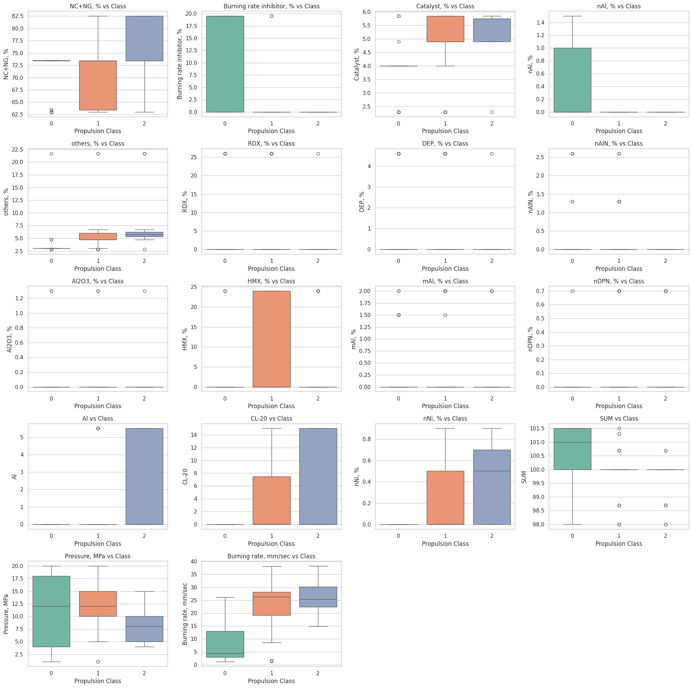
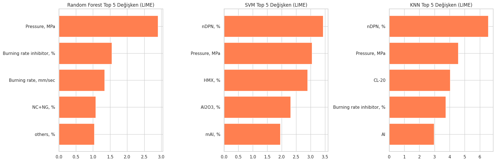
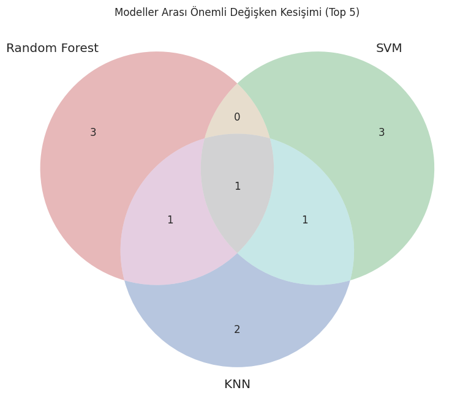

# 🚀 Solid Rocket Propellant Performance Classification

**Comparing Random Forest, SVM, and KNN for Propulsion Quality Prediction**
---

## 📌 Overview

Solid rocket propellants remain a critical technology in both defense and space exploration, offering lower production costs and simpler manufacturing compared to liquid-fueled alternatives. However, the challenge lies in producing *high-quality* propellant consistently.

This project applies machine learning classification techniques to a solid rocket propellant dataset to identify which chemical and physical parameters most strongly determine propellant performance quality. Three classifiers — **Random Forest**, **Support Vector Machine (SVM)**, and **K-Nearest Neighbors (KNN)** — are trained, evaluated, and compared.

---

## 🧪 Dataset

- **Source:** [Kaggle — Solid Rocket Propellant Burning Rate Data](https://www.kaggle.com/datasets/ranjeetsingh7/solid-rocket-propellant-data-burning-rate)
- **Observations:** 137 samples
- **Features:** 18 variables

### Feature Groups

| Category | Features |
|---|---|
| High-energy oxidizers | NC+NG (Nitrocellulose + Nitroglycerin), RDX, HMX, CL-20 |
| Metal additives | nAl (nano), mAl (micro), Al (raw), nAlN, Al₂O₃, nNi |
| Plasticizers & stabilizers | DEP (Diethyl Phthalate), nDPN (n-Diphenylamine) |
| Combustion regulators | Catalyst, Burning rate inhibitor |
| Measurements | Pressure (MPa), Burning rate (mm/s) |

### Custom Target Variable

A novel **Propulsion Quality** metric was derived to convert this regression dataset into a classification problem:

```
Propulsion Quality = Burning Rate / Pressure  →  min-max normalized to [0, 1]
```

This was then divided into three balanced classes using the 33rd and 67th percentiles:

| Class | Propulsion Quality | Count |
|---|---|---|
| Low (0) | < 0.167 | 45 |
| Med (1) | 0.167 – 0.327 | 47 |
| High (2) | > 0.327 | 45 |

---

## 📁 Repository Structure

```
├── Rocket_Propellant_Analysis.ipynb        # Full analysis notebook
├── images/                                 # Plots and visualizations
│   ├── correlation_heatmap.png
│   ├── feature_histograms.png
│   ├── boxplots.png
│   ├── class_distribution.png
│   ├── confusion_matrices.png
│   ├── model_comparison.png
│   ├── lime_importance.png
│   └── venn_diagram.png
└── README.md
```

---

## 🚀 Run Locally

### 1. Clone the repository

```bash
git clone https://github.com/YOUR_USERNAME/YOUR_REPO_NAME.git
cd YOUR_REPO_NAME
```

### 2. Install dependencies

```bash
pip install -r requirements.txt
```

### 3. Download the dataset

Download the dataset from [Kaggle](https://www.kaggle.com/datasets/ranjeetsingh7/solid-rocket-propellant-data-burning-rate) and place the `.xlsx` file in the project root. Then update the file path in the first cell of the notebook:

```python
dosyaYolu = 'Solid_Rocket_Propellant_Burning_Rate_Data.xlsx'
```

### 4. Run the notebook

Open and run all cells in `Rocket_Propellant_Analysis.ipynb` using Jupyter or Google Colab.

```bash
jupyter notebook Rocket_Propellant_Analysis.ipynb
```

> **Google Colab:** Upload the `.xlsx` file to your Colab session and update the path accordingly. The `lime` and `matplotlib-venn` packages will be installed via `!pip install` cells already included in the notebook.

---

## ⚙️ Methodology

### 1. Data Preprocessing
- Null value check (no missing values found)
- Label encoding: Low → 0, Med → 1, High → 2
- Propulsion Quality and Propulsion Class removed from feature inputs to prevent data leakage

### 2. Exploratory Data Analysis (EDA)
- Correlation heatmap
- Feature distribution histograms
- Per-class boxplots
- Class distribution bar chart

### 3. Train / Test Split & Scaling
- 80% training / 20% test split (stratified)
- `StandardScaler` fitted **only on training data** to prevent data leakage

### 4. Models

| Model | Key Parameters |
|---|---|
| Random Forest | `max_depth=5`, `min_samples_leaf=5`, `n_estimators=100` |
| SVM | Default `SVC` with `probability=True` |
| KNN | `k=7` (selected by cross-validating k=1..15; upper bound ≈ √137 ≈ 11.7) |

### 5. Evaluation Metrics
- Accuracy, F1-Score (macro), Recall/Sensitivity, Precision, G-Score

### 6. Interpretability
- **LIME** (Local Interpretable Model-agnostic Explanations) — chosen over SHAP for better performance on small datasets and non-tree models
- **Venn diagram** — visualizing feature overlap across models' top-5 important features

---

## 📊 Results

### Model Performance (Test Set)

| Model | Accuracy | F1-Score | Recall | G-Score |
|---|---|---|---|---|
| **Random Forest** | **0.643** | **0.639** | **0.652** | **0.487** |
| SVM | 0.571 | 0.561 | 0.581 | 0.385 |
| KNN (k=7) | 0.536 | 0.511 | 0.548 | 0.314 |

**Random Forest achieved the best test performance across all metrics.**

### Model Comparison



### Confusion Matrices (Test Set)



- **Low class (0)** was the easiest to classify correctly across all models
- **Med class (1)** caused the most misclassifications — likely due to its overlapping characteristics with Low and High

### Correlation Heatmap



Key correlations found:
- `Burning rate inhibitor` ↔ `Burning rate`: **−0.85** (strong negative)
- `Catalyst` ↔ `Burning rate`: **+0.60** (strong positive)
- `Burning rate` ↔ `Propulsion Class`: **+0.68** (target variable's strongest predictor)

### Feature Distributions





---

## 🔍 Feature Importance (LIME)



Top-5 features per model:

| Rank | Random Forest | SVM | KNN |
|---|---|---|---|
| 1 | Pressure, MPa | nDPN, % | nDPN, % |
| 2 | Burning rate inhibitor | Pressure, MPa | Pressure, MPa |
| 3 | Burning rate, mm/sec | HMX, % | CL-20 |
| 4 | NC+NG, % | Al₂O₃, % | Burning rate inhibitor |
| 5 | others, % | mAl, % | Al |

### Feature Overlap Across Models



**Pressure (MPa)** is the only feature in the top-5 of all three models — confirming it as the single most decisive variable. This aligns with combustion science literature where operating pressure is a fundamental driver of solid propellant burning behavior.

---

## 🔗 References

- [Kaggle Dataset — Solid Rocket Propellant Burning Rate](https://www.kaggle.com/datasets/ranjeetsingh7/solid-rocket-propellant-data-burning-rate)
- [ML-based burning rate prediction (Wiley/Propellants Journal)](https://onlinelibrary.wiley.com/doi/full/10.1002/prep.202200267)
- [Effect of aluminum content on burning rate (ScienceDirect)](https://www.sciencedirect.com/science/article/abs/pii/S0016236113004456)

---

## 📄 License

The dataset is sourced from Kaggle under its respective license. All analysis code is available for educational use.
